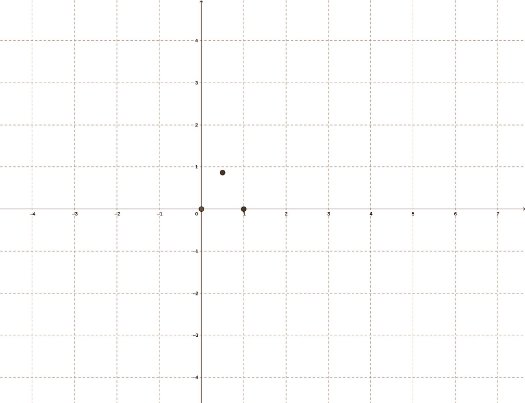
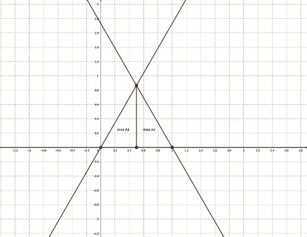
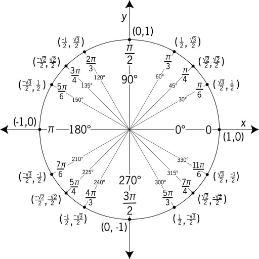
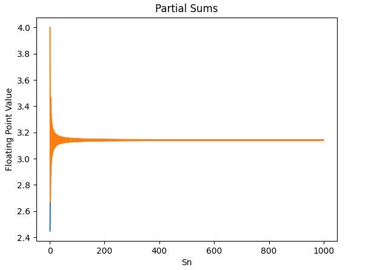
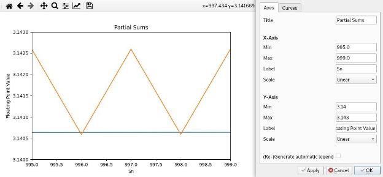
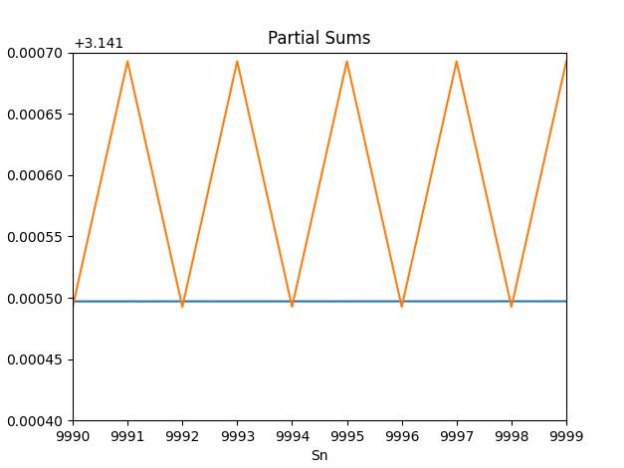
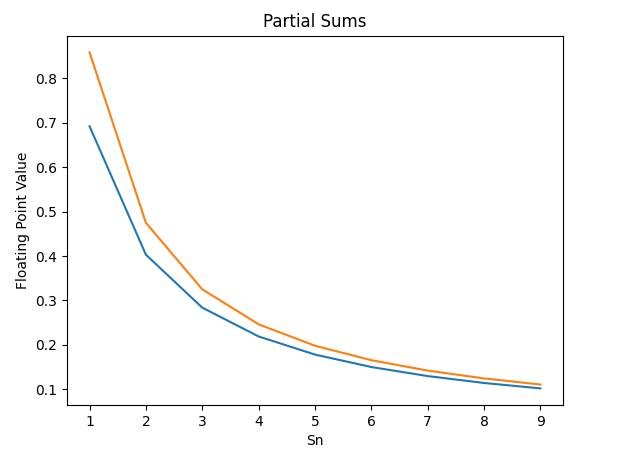
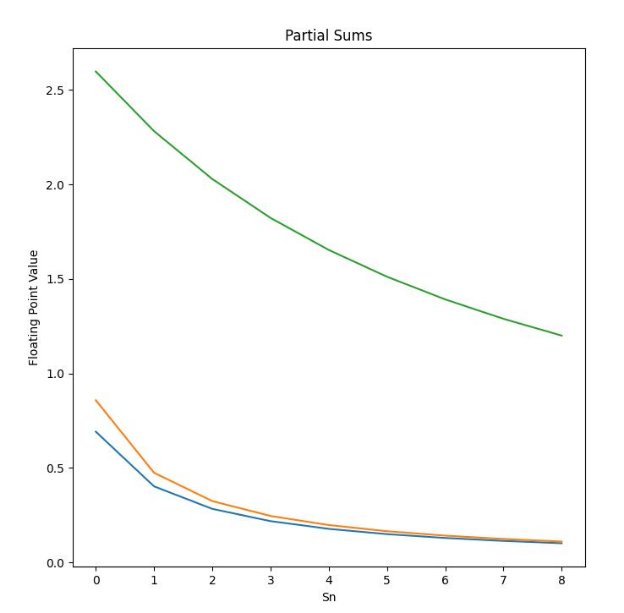

Joseph Shumaker | MATH.V21B.30271 | Calculus/Analytic Geometry II

***Exercise 2.2***: Use what you have learned in Calculus II to find the area of the

triangle made up of the points (0, 0), (1, 0) and ( 1 , 3 ). Then, multiply your answer by

2 2

6 to get the area of the hexagon. Is this a close approximation of π? Why or why not?

***Answer 2.2***:

Our first step when approaching this problem would be to graph the points to their respective coordinates. = (0, 0);  = (1, 0);  = ( 1 ,  3 );

0 1 2 2 2

In order to use calculus, we must draw lines through our points (representing slope) confining the area of two different triangles and use integration with our knowledge of the bounds of x respective to the

different areas to find the total area confined by the triangle. These bounds are from 0 to 1 , and 1 to 1.

2 2

We can use the tools in calculus to find the area under these lines by taking the area of the topmost slope and subtracting it from the bottom most slope using definite integrals. In order to find the equations we need to integrate, we must use point slope form

- ∆ = 2− 1

∆ −

2 1

− = ( − )

1 1

We can use the formulas from point slope form to find the equations of and where:

0 2 1 2

- (0, 0);  = (1, 0);  = ( 1 ,  3 );

0 1 2 2 2 = − 3 = 23 −0 ( − 1 )

0 2 2 1 −0 2

2

- − 3 = 3( − 1 )

0 2 2 2

- = 3( − 1 ) + 3

0 2 2 2

= = 3 − 3 + 3

0 2 2 2

- 3

0 2

And

= − 3 = 23 −0 ( − 1 ) 1 2 2 1 −1 2

2

= − 3 =− 3( − 1 ) 1 2 2 2

- =− 3( − 1 ) + 3

1 2 2 2

- =− 3 + 3 + 3

1 2 2 2

=− 3 + 3

1 2

Since is bounded from 0 to 1 , is bounded from 1 to 1, and is 0 we can say:

1 2 2 2 0 1

1 1 2 2 

- ∫ = ∫ 3
1  0 2

0 0

1 1 

- ∫ = ∫− 3 + 3
2  1 2

1 1

2 2

1 1

2 1 2 1 

- + = ∫  + ∫  = ∫ 3 + ∫− 3 + 3 = 3

1 2 0 2 1 2 4 0 1 0 1

2 2

After we multiply by 6 to get the area of our hexagon, “ 3 \* 6” and we find that the area of our

4

hexagon is 2.59807621, and 2. 59807621 ≈ π.

***Exercise 2.3***: A hexagon is a six sided regular polygon, or a 6-gon. Repeat the process above for inscribing a regular n-gon into the unit circle, and using Calculus to estimate the area, and hence π. Do this for an 8-gon, 16-gon, and 24-gon. What happens as the number of sides of the n−gon approaches ∞?

***Answer 2.3***:

When we talk about π, seldomly do we discuss the meaning behind the constant. π is a ratio that exists between the circumference of a circle and its diameter in all cases. In the exercise above, we used a triangle with a ratio such that it would complete a hexagon shape. This hexagon is close to pi in the sense that its base forms the perimeters of a unit circle divided into 6 equal parts.

Because a complete rotation of a circle is 360◦ or expressed in radians 2π, and it’s divided into n equal parts, we can get our upper and lower bound where we start from θ = 0◦ and end at 2π . We can use the

formula 1 \* ℎ ℎ \* (θ) for the partial triangle thus finding the perimeter for any n-gon,

2

For, “n” number of sides,

2π

n∫ 1 \* ℎ ℎ \* (θ);

2

0

2π 2π

6 6

8-gon = 80∫28π 121 \* ℎ ℎ \* (θ) = 8 ∫ 1 3 (θ) = 2. 59807621 6-gon = 6 ∫ ℎ \* (θ) = 6 ∫ 1 3

2

0

2π

8

* ℎ (θ) = 2. 02922374

2 2

0 0

16-gon = 16 ∫21π6 1 (θ) = 16 ∫21π6 1 3 (θ) = 1. 05475613

* ℎ ℎ \*

2 2

0 0

2π 2π

24 24 

24-gon = 24 ∫ 1 \* ℎ ℎ \* (θ) = 24 ∫ 1 3 (θ) = 0. 70821840

2 2

0 0

And just for fun,

2π 2π

1\*109 1\*109 

1 billion-gon = 1 \* 109 ∫ 1 \* ℎ ℎ \* (θ) = 1 \* 109 ∫ 1 3 (θ) ≈ 0

2 2

0 0

2π

When lim n∫ 1 \* ℎ ℎ \* (θ) the length of the polygons become infinitesimal thus

→ 2

∞ 0

approaching 0 or a circle.

***Example 2.4:*** Consider the sum 1 + 1 + 1 + 1 + 1 + · · · . If you were to continue

2 2 2 2 2

1 2 3 4 5

adding more and more terms following this pattern, the terms would approach to π2 .

6

Solving for π, we get

π = 6( 1 + 1 + 1 + 1 + 1  + · · ·)

12 22 32 42 52

The ℎpartial sum is defined to be of the first n terms. So, for example, the first partial sum is defined to be = 6( 1 ) = 6 = 2. 449489742 and the second partial sum is defined to be the sum of the first

1 2

1

two terms, or = 6( 1 + 1 ) = 15 = 2. 738612787 and so on.

2 12 22 4

***Exercise 2.5***: Compute the tenth partial sum, , the twentieth partial sum , 10 20

and the thirtieth partial sum . What appears to be happening to the partial sums 30

as n increases in ? Do the partial sums appear to be approaching π? ***Answer 2.5***:

For this task I created a Fortran program that will compute the partial sum. Fortran is a compiled language, which means that the code is translated into machine code by a compiler before execution. Python on the other hand, is an interpreted language, which means that the code is executed by an interpreter line by line at runtime. This compilation step allows Fortran to optimize the code and generate faster and more efficient machine code. Fortran is also statically typed language, which means that the data type of a variable is declared at compile time and cannot be changed during runtime. Python on the other hand, is a dynamically typed language, which means that the data type of a variable can change during runtime. This dynamic typing requires extra overhead during execution, which can slow down the execution time of a loop. Fortran is also designed to be memory-efficient, which means that it manages memory allocation and deallocation more efficiently than Python, C++, Or Java. In Python, objects are allocated dynamically at runtime, which can lead to memory fragmentation and slower performance. In summary, Fortran is a language optimized for numerical computing, and its design choices and compiler optimizations make it faster and more efficient for loops and other computational tasks than Python, C++, Or Java. This makes it one of the most superior computer programming languages for quantitative computing.

Below is my Fortran code for this specific .computation:

program Pi\_Project

real(kind = 16) :: Pi\_Computation, n !Stores the values as a 16 bit floating point number

Pi\_Computation = 0

do n = 1, 1000000000

Pi\_Computation = Pi\_Computation + (1/(n\*n)) !Adds 1/n^2 end do

write (\*,'(A, F26.20)') '~pi = ', sqrt(Pi\_Computation\*6) !Prints value end program Pi\_Project

This computation is for and its output is ~pi = 3.14159265 (which is exactly π to 8 decimal places

9

1\*10

🎉). Its mathematical notation is as follows…

π ≈ 6( 1 + 1 + 1 + 1 + 1  + · · · + 1 )

12 22 32 42 52 1\*1018

This computation shows that our terms are approaching π however we can also see the terms approaching π by taking 10th, 20th, and 30th terms by supplementing them into the program.

- 3. 04936164 = 6( 1 + 1 + 1 + 1 + 1 + · · · + 1 )

10 12 22 32 42 52 102

- 3. 09466952 = 6( 1 + 1 + 1 + 1 + 1  + · · · + 1 )

20 12 22 32 42 52 202

- 3. 11012873 = 6( 1 + 1 + 1 + 1 + 1  + · · · + 1 )

30 12 22 32 42 52 302

***Exercise 2.6***: Another infinite sum that generates π is given by

π = 1 − 1 + 1 − 1 + · · ·

4 1 3 5 7

Solving for π we obtain

π = 4( 1 − 1 + 1 − 1 + · · ·)

1 3 5 7

Now = 4( 1 ) = 4, and = 4( 1 − 1 ) = 2. 66666666

1 1 2 1 3

Now compute , , and .

10 20 30

***Answer 2.6***:

To answer this question, I wrote another fortran program that loops through values 1 to the set     number and increments the index by 2. After each iteration, it checks the value of a floating point number

for a 1 or a 0, and depending on its iteration either adds or subtracts the numbers 1 accordingly. Below is the Fortran code:

program Pi\_Project

real(kind = 16) :: Operation, Pi\_Computation, n !Stores value as 16 bit floating point number

Pi\_Computation = 0 !Used to store value Operation = 0 !Used to determine computation

do n = 1, 1000000000, 2 !starting from one to x indexing by step 2

if(Operation == 0) then !Checks operation value

Pi\_Computation = Pi\_Computation + (1/n) !Does appropriate

Shumaker, 7

Joseph Shumaker | calculation

Operation = 1 else

MATH.V21B.30271

| Calculus/Analytic Geometry II

Shumaker, 8

Pi\_Computation = Pi\_Computation - (1/n) Operation = 0

end if end do

write (\*,'(A, F24.20)') '~pi = ', Pi\_Computation\*4 !Finally prints the value to the console

end program Pi\_Project

After running the desired computations, we get:

- 3. 04183962 = 4( 1 − 1 + 1 − 1 + · · · − 1 )

10 1 3 5 7 19

- 3. 09162381 = 4( 1 − 1 + 1 − 1 + · · · − 1 )

20 1 3 5 7 39

- 3. 10826857 = 4( 1 − 1 + 1 − 1 + · · · − 1 )

30 1 3 5 7 59

And just for fun,

- 3. 14159265 (which is exactly π to 8 decimal places 🎉)

9

1\*10

***Exercise 2.7***: Which sum appears to be approaching π more rapidly? The sum

in Example 2.4 and Exercise 2.5 or the sum in Exercise 2.6? Why? How does this compare to inscribing regular n−gons inside the unit circle to approximate π?

***Answer 2.7***:

For the first part of this question, I created a computer program in python that will graph the values of each sum on the same plot to the one-thousandth partial sum so we can better see the values approaching π. Below is the code and the resulting graph.

Shumaker, 
Joseph Shumaker | MATH.V21B.30271 | Calculus/Analytic Geometry II

The first partial sum from exercise 2.5 is colored blue and the second from 2.6 is colored orange. The x-axis of the graph is labeled for the step of our partial sum and the y-axis is its resulting value of the partial sum. We can zoom in on the tail end of the graph to see the resulting behavior of each graph as S approaches 1000.

This graph is much more accurate to the behavior of each partial sum when approaching infinity and there are a few interesting things we can take away. As seen in the first partial sum (The blue graph), we are adding smaller and smaller values and when the graph tends towards infinity we are adding an infinitesimal value. The oscillations we see in the second graph can be explained by the behavior of the operations of each partial sum (Notice the value “Operation” in the second Fortran program). After each iteration of the operation, the new value changes to be either additive or subtractive and the term is

smaller than the previous specifically after addition. For example, = 4( 1 ) = 4 but notice

1 1

- 4( 1 − 1 ) = 2. 6 and finally, = 4( 1 − 1 + 1 ) = 3. 46       (4 > 2. 6  3. 46 > 2. 6).

2 1 3 2 1 3 5

Although the values of the partial sums are approaching an infinitesimal number as the equation goes to infinity, the rate at which the terms are approaching π is not as rapid as the first equation. Solely from a graphical analysis, I noticed something else that was pretty interesting from the above image. On the subtractive intervals, the second graph dips lower than the first graph. My conjecture is that at any point S on the first partial sum, the value will be more accurate to π, as the additive intervals on the second graph are further from π than the subtractive ones. Furthermore, I computed a graph with 10,000 intervals to see if the graph continues to have this property.

These values are exact to pi up to 3 digits. Each change in the value of each graph is <0.0001. However, the second graph continues to dip below the first which is closer to 3.1415 or π up to 4 digits. This means that the first partial sum is more accurate to pi but just to be sure I programmed in another graph that takes the absolute value of π subtracted by the value of the partial sum so we can see just how fast each graph approaches π.

|π − |; |π − |;

Below is an image of the absolute value of π subtracted by the first graphs y value in blue and π subtracted by the second graph's y value in orange.

Using this data, I conclude that the first partial sum approaches π more rapidly and is also more accurate to π as the terms in the partial sum increase. As for its relation to the change of the N-gons as mentioned in exercise 2.3, I also graphed the rate of change as the sides approach 0. The graph is shown below.

And the code is shown here:

import matplotlib.pyplot as plt import scipy.integrate

import numpy

def partial\_sum\_one(values): #Function for the first series

return\_data = list()

for index\_value in range(1, values):

current\_iterations\_point = list() current\_iterations\_point.append(index\_value)

holder = 0

for step\_computation in range(1, index\_value + 1):

holder += 1 / (step\_computation\*\*2) #Appending 1/number^2 current\_iterations\_point.append((6 \* holder) \*\* 0.5) #Multiplying

by 6 and taking square root

return\_data.append(current\_iterations\_point)

return return\_data

def partial\_sum\_two(values):

return\_data = list()

for index\_value in range(1, values):

current\_iterations\_point = list() current\_iterations\_point.append(index\_value)

holder = 0

operation = False #Used to determine operation

for step\_computation in range(1, (index\_value \* 2) + 1, 2):

if operation == False:

holder += 1 / step\_computation #Adds 1/number operation = True

else:

holder -= 1 / step\_computation #Subtracts 1/number operation = False

current\_iterations\_point.append((4 \* holder)) #Multiplies the series by 4

return\_data.append(current\_iterations\_point)

return return\_data

def ngon(triangles):

integration = scipy.integrate.quad(lambda x: triangles\*0.5\*(3\*\*0.5)\*numpy.sin(x), 0, (2\*(numpy.pi))/triangles) #Integral for base \* height \* sin(x). Integrates from 0 to 2pi/ngon

return(integration)

def comprehend\_2(values):

for count in range(6, values):

yield(ngon(count)[0])

dataset\_1 = partial\_sum\_one(10) dataset\_2 = partial\_sum\_two(10) dataset\_3 = list(comprehend\_2(15))

def comprehend(dataset):

holder = [dataset[i][1] for i in range(len(dataset))]

return [abs(3.1415926535 - holder[i]) for i in range(len(holder))]

#Code below is used to plot the data.

plt.plot([index for index in range(len(dataset\_1))], comprehend(partial\_sum\_one(10)))

plt.plot([index for index in range(len(dataset\_2))], comprehend(partial\_sum\_two(10)))

plt.plot([index for index in range(len(dataset\_3))], dataset\_3) plt.title("Partial Sums")

plt.xlabel("Sn")

plt.ylabel("Floating Point Value")

plt.show()

The n gons approaching zero are graphed in green and start from a hexagon (6 gon). And with that, we have the conclusion of my computations with the fastest converging function graphed in blue.
Shumaker, 14
